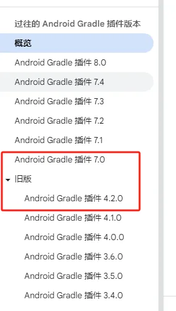
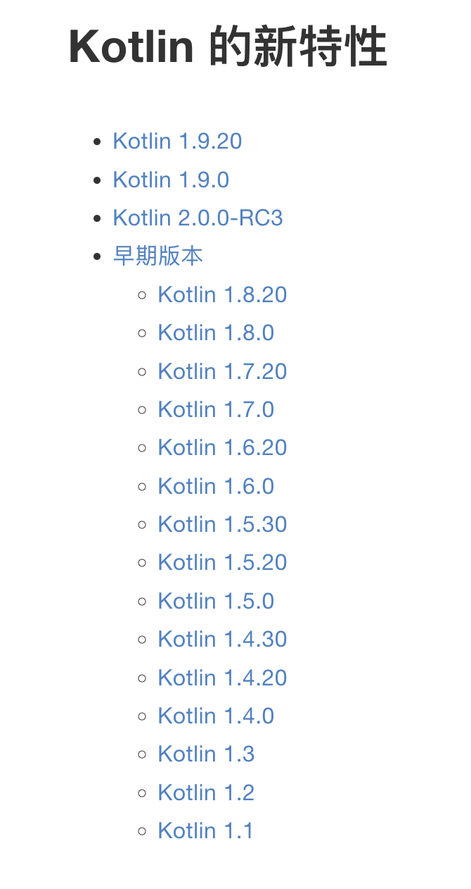

# 简介

Android Studio 构建系统以 Gradle 为基础，在Gradle的基础上，定制了针对Android 应用构建系统的Gradle插件，所以，全称为 Android Gradle plugin（AGP）。

它配置在我们的project根目录中的**build.gradle**文件中

```
buildscript {
    ...
    dependencies {
        classpath 'com.android.tools.build:gradle:7.4.2'
    }
}
```

然后在个Module中的**build.gradle**文件中使用

```
plugins {
    id 'com.android.application'
}
```


而KGP同理，就是针对kotlin开发环境提供的Gradle插件。也就是，你开发要用到kotlin的话，就需要配置它，也配置在我们的project根目录中的**build.gradle**文件中

```
buildscript {
    ...
    dependencies {
        classpath 'org.jetbrains.kotlin:kotlin-gradle-plugin:1.8.22'
    }
}
```

然后在个Module中的**build.gradle**文件中使用

```
plugins {
    id 'org.jetbrains.kotlin.android'
}
```


# AGP-KGP版本说明

AGP版本迭代文档：https://developer.android.com/build/releases/past-releases?hl=zh-cn

KGP文档：https://book.kotlincn.net/text/gradle-configure-project.html

在早期，AGP都是一个小版本在更新，但是在 **AGP4.2.0** 之后，AGP的版本直接就到了 **AGP7.0** 了，这样跳版本的目的，官方的解释是:

>  我们将更新 Android Gradle 插件 (AGP) 的版本号，以使其更接近底层 Gradle 构建工具。AGP 4.2 之后的版本为版本 7.0，并且会要求升级到 Gradle 7.x 版。AGP 的每个主要版本都会要求在底层 Gradle 工具中进行主要版本升级。每年将发布一个 AGP 主要版本，与 Gradle 主要版本保持一致。




而KGP就比较简单了，它就是跟随kotlin的版本来更新的。




下面收集了它们与gradle版本的关系：

KGP文档地址：https://book.kotlincn.net/text/gradle-configure-project.html

| KGP version   | Gradle min and max versions | AGP min and max versions |
| ------------- | --------------------------- | ------------------------ |
| 1.9.20–1.9.24 | 6.8.3–8.1.1                 | 4.2.2–8.1.0              |
| 1.9.0–1.9.10  | 6.8.3–7.6.0                 | 4.2.2–7.4.0              |
| 1.8.20–1.8.22 | 6.8.3–7.6.0                 | 4.1.3–7.4.0              |
| 1.8.0–1.8.11  | 6.8.3–7.3.3                 | 4.1.3–7.2.1              |
| 1.7.20–1.7.22 | 6.7.1–7.1.1                 | 3.6.4–7.0.4              |
| 1.7.0–1.7.10  | 6.7.1–7.0.2                 | 3.4.3–7.0.2              |
| 1.6.20–1.6.21 | 6.1.1–7.0.2                 | 3.4.3–7.0.2              |

AGP文档地址：https://developer.android.google.cn/build/releases/past-releases?hl=zh-cn

| AGP version   | Gradle min versions | SDK Build Tools min version | Java min version |
| ------------- | ------------------- | --------------------------- | ---------------- |
| 8.9.0+        | 8.11.1              | 35.0.0                      | 17               |
| 8.8.0+        | 8.10.2              | 35.0.0                      | 17               |
| 8.7.0+        | 8.9                 | 34.0.0                      | 17               |
| 8.6.0+        | 8.7                 | 34.0.0                      | 17               |
| 8.5.0+        | 8.7                 | 34.0.0                      | 17               |
| 8.4.0+        | 8.6                 | 34.0.0                      | 17               |
| 8.3.0+        | 8.4                 | 34.0.0                      | 17               |
| 8.2.0+        | 8.2                 | 34.0.0                      | 17               |
| 8.1.0+        | 8.0                 | 33.0.1                      | 17               |
| 8.0.0+        | 8.0                 | 30.0.3                      | 17               |
| 7.4.0+        | 7.5                 | 30.0.3                      | 11               |
| 7.3.0+        | 7.4                 | 30.0.3                      | 11               |
| 7.2.0+        | 7.3.3               | 30.0.3                      | 11               |
| 7.1.0+        | 7.2                 | 30.0.3                      | 11               |
| 7.0.0+        | 7.0                 | 30.0.2                      | 11               |
| 4.2.0+        | 6.7.1               | 30.0.2                      | 7                |
| 4.1.0+        | 6.5+                | 29.0.2                      | 7                |
| 4.0.0+        | 6.1.1+              | 29.0.2                      | 7                |
| 3.6.0 - 3.6.4 | 5.6.4+              | 28.0.3                      | 7                |
| 3.5.0 - 3.5.4 | 5.4.1+              | 28.0.3                      | 7                |
| 3.4.0 - 3.4.3 | 5.1.1+              | 28.0.3                      | 7                |
| 3.3.0 - 3.3.3 | 4.10.1+             | 28.0.3                      | 7                |
| 3.2.0 - 3.2.1 | 4.6+                | 28.0.3                      | 7                |
| 3.1.0+        | 4.4+                | 27.0.3                      | 7                |
| 3.0.0+        | 4.1+                | 26.0.2                      | 7                |
| 2.3.0+        | 3.3+                | 25.0.0                      | 7                |
| 2.1.3 - 2.2.3 | 2.14.1 - 3.5        | 23.0.2                      | 7                |
| 2.0.0 - 2.1.2 | 2.10 - 2.13         | 21.1.1                      | 7                |
| 1.5.0         | 2.2.1 - 2.13        | 21.1.1                      | 7                |
| 1.2.0 - 1.3.1 | 2.2.1 - 2.9         | 21.1.1                      | 7                |
| 1.0.0 - 1.1.3 | 2.2.1 - 2.3         | 21.1.1                      | 7                |

| Android Studio 版本          | 所需插件版本 |
| ---------------------------- | ------------ |
| Meerkat \| 2024.3.1          | 3.2-8.9      |
| Ladybug 功能更新 \| 2024.2.2 | 3.2-8.8      |
| Ladybug \| 2024.2.1          | 3.2-8.7      |
| Koala 功能更新 \| 2024.1.2   | 3.2-8.6      |
| Koala \| 2024.1.1            | 3.2-8.5      |
| Jellyfish \| 2023.3.1        | 3.2-8.4      |
| Iguana \| 2023.2.1           | 3.2-8.3      |
| Hedgehog \| 2023.1.1         | 3.2-8.2      |
| Giraffe \| 2022.3.1          | 3.2-8.1      |
| Flamingo \| 2022.2.1         | 3.2-8.0      |
| Electric Eel \| 2022.1.1     | 3.2-7.4      |
| Dolphin \| 2021.3.1          | 3.2-7.3      |
| Chipmunk \| 2021.2.1         | 3.2-7.2      |
| Bumblebee \| 2021.1.1        | 3.2-7.1      |
| Arctic Fox \| 2020.3.1       | 3.1-7.0      |


