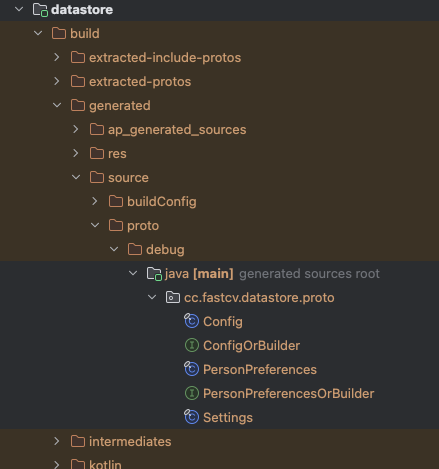

# 概述

在安卓系统数据持久化的方案中，SharedPreferences一直处于很重要的位置，如果您有想要保存的相对较小键值对集合，则可以使用 SharedPreferences API。SharedPreferences 对象指向包含键值对的文件，并提供读写这些键值对的简单方法。每个 SharedPreferences 文件均由框架进行管理，可以是私有文件，也可以是共享文件。

而在后来，google又推出了DataStrore，DataStore 是一种现代数据存储解决方案，意在代替 SharedPreferences。它基于 Kotlin 协程和 Flow 构建，并克服了 SharedPreferences 的许多缺点。

并且DataStore 提供两种不同的实现：Preferences DataStore 和 Proto DataStore。

- **Preferences DataStore** 与 SharedPreferences 一样，根据键访问数据，而无需事先定义架构，也不确保类型安全。
- **Proto DataStore** 使用 protocol-buffers 来定义架构。使用协议缓冲区可**持久保留强类型数据**，并且可以确保类型安全。与 XML 和其他类似的数据格式相比，协议缓冲区速度更快、规格更小、使用更简单，并且更清楚明了。虽然使用 Proto DataStore 需要学习新的序列化机制，但Google开发团队认为 Proto DataStore 有着强大的类型优势，值得学习。

| **功能**                             | **SharedPreferences**               | **PreferencesDataStore**                       | **ProtoDataStore**                             |
| ------------------------------------ | ----------------------------------- | ---------------------------------------------- | ---------------------------------------------- |
| 异步 API                             | ✅（仅用于通过监听器读取已更改的值） | ✅（通过 `Flow` 以及 RxJava 2 和 3 `Flowable`） | ✅（通过 `Flow` 以及 RxJava 2 和 3 `Flowable`） |
| 同步 API                             | ✅（但无法在界面线程上安全调用）     | ❌                                              | ❌                                              |
| 可在界面线程上安全调用               | ❌                                   | ✅（这项工作已在后台移至 `Dispatchers.IO`）     | ✅（这项工作已在后台移至 `Dispatchers.IO`）     |
| 可以提示错误                         | ❌                                   | ✅                                              | ✅                                              |
| 不受运行时异常影响                   | ❌                                   | ✅                                              | ✅                                              |
| 包含一个具有强一致性保证的事务性 API | ❌                                   | ✅                                              | ✅                                              |
| 处理数据迁移                         | ❌                                   | ✅                                              | ✅                                              |
| 类型安全                             | ❌                                   | ❌                                              | ✅ 使用protocol-buffers                         |

说明：

1、SharedPreferences 有一个看上去可以在界面线程中安全调用的同步 API，但是该 API 实际上执行磁盘 I/O 操作。此外，apply() 会阻断 fsync() 上的界面线程。每次有服务启动或停止以及每次 activity 在应用中的任何地方启动或停止时，系统都会触发待处理的 fsync() 调用。界面线程在 apply() 调度的待处理 fsync() 调用上会被阻断，这通常会导致 ANR。

2、SharedPreferences 会将解析错误作为运行时异常抛出。


# ShreadPreferences

SharedPreferences 对象指向包含键值对的文件，并提供读写这些键值对的简单方法。每个 SharedPreferences 文件均由框架进行管理，可以是私有文件，也可以是共享文件。


## 获取SharedPreferences对象

获取SharedPreferences对象的方式有两个：

- getSharedPreferences() - 如果您需要多个由名称（使用第一个参数指定）标识的SharedPreferences文件，则使用此方法。您可以从您的应用中的任何 Context 调用此方法。

  ```
      val sp: SharedPreferences = context.getSharedPreferences("名称", MODE_PRIVATE)
  ```

  为SharedPreferences文件命名时，应使用可唯一标识您的应用的名称。官方建议将应用 ID作为文件名的前缀。

- getPreferences() - 对于 activity，如果您只需使用一个共享偏好设置文件，请从 Activity 中使用此方法。由于这会检索属于该 Activity 的默认共享偏好设置文件，因此您无需提供名称。

  ```
      val sp: SharedPreferences = getPreferences(MODE_PRIVATE)
  ```

  其实内部实现还是用的上面的，只不过自己生成了名称参数

  ```
      public SharedPreferences getPreferences(@Context.PreferencesMode int mode) {
          return getSharedPreferences(getLocalClassName(), mode);
      }
      
      @NonNull
      public String getLocalClassName() {
          final String pkg = getPackageName();
          final String cls = mComponent.getClassName();
          int packageLen = pkg.length();
          if (!cls.startsWith(pkg) || cls.length() <= packageLen
                  || cls.charAt(packageLen) != '.') {
              return cls;
          }
          return cls.substring(packageLen+1);
      }
  ```

  

**注意：**自 API 级别 17 起，**MODE_WORLD_READABLE** 和 **MODE_WORLD_WRITEABLE** 模式已被废弃。从 **Android 7.0（API 级别 24）**开始，如果您使用这些模式，Android 会抛出 SecurityException。如果您的应用需要与其他应用共享私有文件，可以通过 FLAG_GRANT_READ_URI_PERMISSION 使用 **FileProvider**。


## 向SharedPreferences对象中写入值

写入值前，通过SharedPreferences 对象的edit()方法创建一个 SharedPreferences.Editor对象。然后使用此对象的 putInt() 或者 putString() 等方法写入的键和值。最后，调用 apply() 或 commit() 以保存更改。例如：

```java
        //可以创建一个新的SharedPreference来对储存的文件进行操作
        val sp = context.getSharedPreferences("名称", MODE_PRIVATE)
        //像SharedPreference中写入数据需要使用Editor
        val editor: SharedPreferences.Editor = sp.edit()
        //类似键值对
        editor.putString("name", "string")
        editor.putInt("age", 0)
        editor.putBoolean("read", true)
        //editor.apply()
        editor.commit()
```

**注意：**

- apply() 和 commit() 都是提交保存，区别在于apply是异步执行的，apply() 会立即更改内存中的 SharedPreferences 对象，但会将更新异步写入磁盘，不需要等待。commit是同步执行的，需要等待。但是由于 commit() 是同步的，您应避免从主线程调用它，因为它可能会暂停您的界面呈现。
- 不论删除，修改，增加都必须调用apply或者commit提交保存。

- 关于更新：如果已经插入的key已经存在。那么将更新原来的key的值。

- 应用程序一旦卸载，SharedPreference也会被删除。


## 从SharedPreferences对象中读取值

通过SharedPreferences 对象，可以调用 getInt() 和 getString() 等方法去读取存储的值；如果键不存在，则可以选择返回默认值或者null。例如：

```java
        val sp: SharedPreferences = context.getSharedPreferences("名称", MODE_PRIVATE) ?: return

        //第一个参数是键名，第二个是默认值
        val name: String = sp.getString("name", "暂无")
        val age: Int = sp.getInt("age", 0)
        val read: Boolean = sp.getBoolean("isRead", false)
```


也可以在读取值之前，检查下key值存不存在。

```java
        val sp = context.getSharedPreferences("名称", MODE_PRIVATE)
        //检查当前键是否存在
        val isContains = sp.contains("key")
        //使用getAll可以返回所有可用的键值
        //val allMaps = sp.getAll()
```


## 从SharedPreferences对象中删除键值对

通过SharedPreferences 对象的edit()方法创建一个 SharedPreferences.Editor对象。然后使用此对象的 remove() 或者 clear() 等方法清除键值对。最后，调用 apply() 或 commit() 以保存更改。例如：

```java
        val sp: SharedPreference = getSharedPreferences("名称", MODE_PRIVATE)
        val editor: SharedPrefence.Editor = sp.edit()
        //删除键值对
        editor.remove(key)
        editor.apply()
        //删除所有
        //editor.clear()
        //editor.commit()
```

**注意：**

当我们要清除SharedPreferences中的数据的时候不要直接去删除SharedPreferences对应的文件。因为SharedPreferences在应用启动后会被加载到内存里面，然后每次通过内存里面的内容覆盖这个文件的内容，如果删除掉文件后，再次执行commit()等方法，删除的文件会重生，重生文件的数据和删除之前的数据相同，因为内存里面的数据还是和之前一样的。除非删除文件后马上退出程序。

一切按照官方提供的API来操作就行了。


## 监听SharedPreferences对象中的键值变化

```
        sp.registerOnSharedPreferenceChangeListener { sharedPreferences, key ->
            if (key == "stringKey") {
                Log.d(TAG, "onCreate: key = $key   value = ${sharedPreferences.getString(key, "")}")
            }
        }
```


## SharedPreferences的使用封装

为了更加方便的使用，我们将固定的代码封装起来，提供方法来简化操作：

```
object SharedPreferencesHelper {

    /**
     * 存入String值
     */
    fun put(context: Context, spName:String , key: String, value: String) {
        context.getSharedPreferences(spName, Context.MODE_PRIVATE).edit().putString(key, value).apply()
    }

    /**
     * 存入Int值
     */
    fun put(context: Context, spName:String , key: String, value: Int) {
        context.getSharedPreferences(spName, Context.MODE_PRIVATE).edit().putInt(key, value).apply()
    }

    /**
     * 存入Long值
     */
    fun put(context: Context, spName:String , key: String, value: Long) {
        context.getSharedPreferences(spName, Context.MODE_PRIVATE).edit().putLong(key, value).apply()
    }

    /**
     * 存入Float值
     */
    fun put(context: Context, spName:String , key: String, value: Float) {
        context.getSharedPreferences(spName, Context.MODE_PRIVATE).edit().putFloat(key, value).apply()
    }

    /**
     * 存入Boolean值
     */
    fun put(context: Context, spName:String , key: String, value: Boolean) {
        context.getSharedPreferences(spName, Context.MODE_PRIVATE).edit().putBoolean(key, value).apply()
    }

    /**
     * 存入Set<String?>值
     */
    fun put(context: Context, spName:String , key: String, values: Set<String?>) {
        context.getSharedPreferences(spName, Context.MODE_PRIVATE).edit().putStringSet(key, values).apply()
    }

    /**
     * 获取String值
     */
    fun getString(context: Context, spName:String , key: String, defaultValue: String): String {
        return context.getSharedPreferences(spName, Context.MODE_PRIVATE).getString(key, defaultValue)?:defaultValue
    }

    /**
     * 获取Int值
     */
    fun getInt(context: Context, spName:String , key: String, defaultValue: Int): Int {
        return context.getSharedPreferences(spName, Context.MODE_PRIVATE).getInt(key, defaultValue)
    }

    /**
     * 获取Long值
     */
    fun getLong(context: Context, spName:String , key: String, defaultValue: Long): Long {
        return context.getSharedPreferences(spName, Context.MODE_PRIVATE).getLong(key, defaultValue)
    }

    /**
     * 获取Float值
     */
    fun getFloat(context: Context, spName:String , key: String, defaultValue: Float): Float {
        return context.getSharedPreferences(spName, Context.MODE_PRIVATE).getFloat(key, defaultValue)
    }

    /**
     * 获取Boolean值
     */
    fun getBoolean(context: Context, spName:String , key: String, defaultValue: Boolean): Boolean {
        return context.getSharedPreferences(spName, Context.MODE_PRIVATE).getBoolean(key, defaultValue)
    }

    /**
     * 获取Set<String?>值
     */
    fun getStringSet(context: Context, spName:String , key: String, defaultValue: Set<String?>): Set<String>? {
        return context.getSharedPreferences(spName, Context.MODE_PRIVATE).getStringSet(key, defaultValue)
    }

    /**
     * 判断是否包含key值
     */
    fun contains(context: Context, spName:String , key: String): Boolean {
        return context.getSharedPreferences(spName, Context.MODE_PRIVATE).contains(key)
    }

    /**
     * 移除key值及对应的value值
     */
    fun remove(context: Context, spName:String , key: String) {
        context.getSharedPreferences(spName, Context.MODE_PRIVATE).edit().remove(key).apply()
    }

    /**
     * 清空sp中的数据
     */
    fun clear(context: Context, spName:String) {
        context.getSharedPreferences(spName, Context.MODE_PRIVATE).edit().clear().apply()
    }
}
```

如果你熟悉Kotlin的扩展的话，还可以进一步封装，例如：

```
fun Context.saveIntIntoSharedPreferences(spName: String, key: String, value: String) {
    SharedPreferencesHelper.put(this, spName, key, value)
}
```


# DataStore

Jetpack DataStore 是一种数据存储解决方案，允许您使用 protocol-buffers 存储键值对或类型化对象。DataStore 使用 Kotlin 协程和 Flow 以异步、一致的事务方式存储数据。

如果您目前是使用 SharedPreferences 存储数据的，请考虑迁移到 DataStore。

DataStore 提供两种不同的实现：Preferences DataStore 和 Proto DataStore。

- Preferences DataStore 使用键存储和访问数据。此实现不需要预定义的架构，也不确保类型安全。
- Proto DataStore 将数据作为自定义数据类型的实例进行存储。此实现要求您使用 protocol-buffers 来定义架构，但可以确保类型安全。


## Preferences DataStore

[官方示例代码](https://github.com/android/codelab-android-datastore/tree/preferences_datastore)

### 添加依赖

```
    // Preferences DataStore (SharedPreferences like APIs)
    dependencies {
        implementation "androidx.datastore:datastore-preferences:1.1.0"

        // optional - RxJava2 support
        implementation "androidx.datastore:datastore-preferences-rxjava2:1.1.2"

        // optional - RxJava3 support
        implementation "androidx.datastore:datastore-preferences-rxjava3:1.1.2"
    }

    // 或者 使用不依赖Android sdk的库。
    dependencies {
        implementation "androidx.datastore:datastore-preferences-core:1.1.2"
    }
```


### 获取DataStore \<Preferences\>对象

我们可以用属性委托的方式创建**DataStore\<Preferences>**的实例，如下面的代码。比较推荐的方法是在Kotlin文件顶层创建实例一次，便可在应用的所有其余部分通过此属性访问该实例。这样可以更轻松地将 DataStore 保留为单例。如果使用的是 RxJava，请使用 RxPreferenceDataStoreBuilder。必需的 name 参数是 Preferences DataStore 的名称。

```
	// At the top level of your kotlin file:
	val Context.dataStore: DataStore<Preferences> by preferencesDataStore(name = "settings")
```


### 向DataStore \<Preferences\>对象中写入值

DataStore \<Preferences\>对象提供了一个 edit() 函数，用于以事务方式更新 DataStore 中的数据。该函数的 transform 参数接受代码块，您可以在其中根据需要更新值。转换块中的所有代码均被视为单个事务。然后为了读取内容，我们需要根据内容的属性使用特定的Key。下列代码是当内容为String的情况下，需要调用**stringPreferencesKey**方法。

```kotlin
    //定义要操作的key
    private val key = stringPreferencesKey("keyName")
```

定义完key之后，我们就可以通过这个key去存对应的值。

```kotlin
    runBlocking {
        dataStore.edit { it[key] = "疫情" }
    }
```

相应的其他类型的：

```kotlin
    private val intKey = intPreferencesKey("name")
    private val doubleKey = doublePreferencesKey("name")
    private val stringKey = stringPreferencesKey("name")
    private val booleanKey = booleanPreferencesKey("name")
    private val floatKey = floatPreferencesKey("name")
    private val longKey = longPreferencesKey("name")
    private val stringSetKey = stringSetPreferencesKey("name")
```


### 从DataStore \<Preferences\>对象中读取值

由于 Preferences DataStore 不使用预定义的架构，因此您必须使用相应的键类型函数为需要存储在 DataStore \<Preferences\>对象中的每个值定义一个键。然后，使用 DataStore.data 属性，通过 Flow 提供适当的存储值。

```
        val key = stringPreferencesKey("keyName")
        val stringFlow:Flow<String?> = dataStore.data.map { it[key] }
        runBlocking {
            val stringValue = stringFlow.first()
        }
```

并且在此基础上面还提供了读取异常的监听方式

```
        val key = stringPreferencesKey("keyName")
        return dataStore.data
            .catch { exception ->
                exception.printStackTrace()
            }
            .map {
            it[key]
        }.first()
```


### 从DataStore \<Preferences\>对象中删除键值对

同样提供了清除键值对的方式

```
        val key = stringPreferencesKey("keyName")
        runBlocking {
            dataStore.edit {
                it.remove(key)
                //清除所有
                it.clear()
            }
        }
```


### 监听DataStore \<Preferences\>对象中键值对变化

本身返回的已经是个Flow对象了，Flow对象本身就支持监听。


### DataStore的使用封装

为了更加方便的使用，我们将固定的代码封装起来，提供方法来简化操作：

```
object DataStorePreferencesHelper {

    private val Context.dataStore: DataStore<Preferences> by androidx.datastore.preferences.preferencesDataStore(
        name = "settings"
    )

    suspend fun put(context: Context, key: String, value: String) {
        context.dataStore.edit {
            it[stringPreferencesKey(key)] = value
        }
    }

    suspend fun put(context: Context, key: String, value: Int) {
        context.dataStore.edit {
            it[intPreferencesKey(key)] = value
        }
    }

    suspend fun put(context: Context, key: String, value: Long) {
        context.dataStore.edit {
            it[longPreferencesKey(key)] = value
        }
    }

    suspend fun put(context: Context, key: String, value: Float) {
        context.dataStore.edit {
            it[floatPreferencesKey(key)] = value
        }
    }

    suspend fun put(context: Context, key: String, value: Boolean) {
        context.dataStore.edit {
            it[booleanPreferencesKey(key)] = value
        }
    }

    suspend fun put(context: Context, key: String, value: Set<String>) {
        context.dataStore.edit {
            it[stringSetPreferencesKey(key)] = value
        }
    }

    suspend fun getString(context: Context, key: String, defaultValue: String): String {
        return context.dataStore.data.map { it[stringPreferencesKey(key)] }.first() ?: defaultValue
    }

    suspend fun getInt(context: Context, key: String, defaultValue: Int): Int {
        return context.dataStore.data.map { it[intPreferencesKey(key)] }.first() ?: defaultValue
    }

    suspend fun getLong(context: Context, key: String, defaultValue: Long): Long {
        return context.dataStore.data.map { it[longPreferencesKey(key)] }.first() ?: defaultValue
    }

    suspend fun getFloat(context: Context, key: String, defaultValue: Float): Float {
        return context.dataStore.data.map { it[floatPreferencesKey(key)] }.first() ?: defaultValue
    }

    suspend fun getBoolean(context: Context, key: String, defaultValue: Boolean): Boolean {
        return context.dataStore.data.map { it[booleanPreferencesKey(key)] }.first() ?: defaultValue
    }

    suspend fun getStringSet(
        context: Context,
        spName: String,
        key: String,
        defaultValue: Set<String>
    ): Set<String> {
        return context.dataStore.data.map { it[stringSetPreferencesKey(key)] }.first() ?: defaultValue
    }

    suspend fun <T> contains(context: Context, key: Preferences.Key<T>): Boolean {
        return context.dataStore.data.map { it.contains(key) }.first()
    }

    suspend fun <T> remove(context: Context, key: Preferences.Key<T>) {
        context.dataStore.edit {
            it.remove(key)
        }
    }

    suspend fun clear(context: Context, spName: String) {
        context.dataStore.edit {
            it.clear()
        }
    }
}
```


### 从 SharedPreferences 迁移到 Preferences DataStore

DataStore 构建器提供了produceMigrations参数可以传入 SharedPreferencesMigration。DataStore 借此能够自动从 SharedPreferences 迁移到 DataStore。迁移需在 DataStore 中的任何数据访问操作发生之前运行。这意味着，必须在 DataStore.data 发出任何值之前和 DataStore.edit() 可以更新数据之前，成功完成迁移。

```
    private val Context.dataStoreBySp: DataStore<Preferences> by preferencesDataStore(name = "settings", produceMigrations = { context ->
        listOf(SharedPreferencesMigration(context,"spName"))
    })
```

**注意：**由于键只能从 SharedPreferences 迁移一次，因此在代码迁移到 DataStore 之后，您应停止使用旧 SharedPreferences。


## Proto DataStore

Proto DataStore 实现使用 DataStore 和 protocol-buffers 将类型化对象保留在磁盘上。

[官方示例代码](https://github.com/android/codelab-android-datastore/tree/proto_datastore)

### 添加依赖

```
    // Typed DataStore (Typed API surface, such as Proto)
    dependencies {
        implementation "androidx.datastore:datastore:1.1.2"

        // optional - RxJava2 support
        implementation "androidx.datastore:datastore-rxjava2:1.1.2"

        // optional - RxJava3 support
        implementation "androidx.datastore:datastore-rxjava3:1.1.2"
    }

    // 或者 使用不依赖Android sdk的库。
    dependencies {
        implementation "androidx.datastore:datastore-core:1.1.2"
    }
```

等等，不要慌，使用这个功能不是单单添加依赖就可以用的。还需要添加 protocol-buffers 的相关内容。

添加插件：

```
buildscript {
    ...
    dependencies {
        ...
        classpath 'com.google.protobuf:protobuf-gradle-plugin:0.9.1'
    }
}
```

使用插件

```
plugins {
    id 'com.google.protobuf'
}

或者不添加插件，直接这么写
plugins {
    ...
    id "com.google.protobuf" version "0.8.17"
}
```


然后添加对应的依赖：

```
    implementation  'androidx.datastore:datastore-core:1.0.0'
    implementation  'com.google.protobuf:protobuf-javalite:3.10.0'
```


最后配置protobuf

```
dependencies {
    ...

    implementation  'androidx.datastore:datastore-core:1.0.0'
    implementation  'com.google.protobuf:protobuf-javalite:3.10.0'


}

protobuf {
    protoc {
    		//m1电脑适配环境
        if (osdetector.os == "osx") {
            artifact = "com.google.protobuf:protoc:3.10.0:osx-x86_64"
        } else {
            artifact = "com.google.protobuf:protoc:3.10.0"
        }
    }

    // 为该项目中的 Protobufs 生成 java Protobuf-lite 代码。
    generateProtoTasks {
        all().each { task ->
            task.builtins {
                java {
                    option 'lite'
                }
            }
        }
    }
}
```


这样， protocol-buffers 的基本环境就搭建好了。接下来就是定义我们的数据了。

在当前module的 **mian** 目录下新建 **proto** 文件夹，再新建 **settings.proto** 文件（这里需要下载一个插件，自己去插件市场搜protobuf关键字，下载用户量最多的就行了）。在文件中写入：

```
//声明协议， 也支持 prota2，普遍使用proto3
syntax = "proto3";

//设置生成的类所在的包
option java_package = "cc.fastcv.datastore.proto";
//可能会有多个文件。
option java_multiple_files = true;

message PersonPreferences {
    reserved 4;
    string name = 1;
    int32 age = 2;
    string address = 3;
    Config config = 5;
}

message Config {
    repeated string index = 1;
}
```

然后直接 **make project** 就生成了我们需要的代码。**切记，要构建下我们的项目才行。**


接下来的所有操作都是围绕这个进行的。


###  proto文件内容简单说明

[官方文档](https://protobuf.dev/)

```kotlin
syntax = "proto3";
```

声明协议版本，这个直接照搬即可。


```kotlin
option java_package = "com.example.myapplication.datastore";
```

定义我们的产物文件存放的目录（或者说 包名）


```kotlin
option java_multiple_files = true;
```

我的理解是，这个属性是支持生成多个文件


```kotlin
message PersonPreferences {
  reserved 4;
  string name = 1;
  int32 age = 2;
  string address = 3;
  Config config = 5;
}
```

这个就是标准的模型的定义，比如这里定义了一个 name 类型是 string类型的，分给它存储的位置是1（这个位置每个字段独一无二），而 reserved 4 表示的是 4 这个位置预留出来，无法被其他地方使用（比如我们删除了某个字段，但是它的位置不能删除，就可以用这种方式来删除字段）。


对应的类型如下：

| .proto 类型 | Java/Kotlin 类型 |
| ----------- | ---------------- |
| double      | double           |
| float       | float            |
| int32       | int              |
| int64       | long             |
| sint32      | int              |
| sint64      | long             |
| bool        | boolean          |
| string      | String           |


同样，我们可以使用其他的 Message 当成类型来使用，比如这里的 Config 

```kotlin
message Config {
  repeated string index = 1;
}
```

里面有个标识符 repeated 需要注意，它表示这个字段可以无限使用，这里可以理解为 Config 里面有个 List来存储 Index。实际上也是这个实现的。


### 获取DataStore\<T>对象

```
    private val Context.settingsStore: DataStore<PersonPreferences> by dataStore(
        fileName = "settings.pb",
        serializer = PersonSerializer
    )
```

这里需要一个serializer参数，实现为：

```
object PersonSerializer : Serializer<PersonPreferences> {

    override val defaultValue: PersonPreferences = PersonPreferences.getDefaultInstance()

    override suspend fun readFrom(input: InputStream): PersonPreferences {
        try {
            return PersonPreferences.parseFrom(input)
        } catch (exception: InvalidProtocolBufferException) {
            throw CorruptionException("Cannot read proto.", exception)
        }
    }

    override suspend fun writeTo(t: PersonPreferences, output: OutputStream) = t.writeTo(output)
}
```

简单来说，就是需要我们自己来实现下序列化中的数据写入与读取。


### 向DataStore\<T>对象中写入值

```
        runBlocking {
            settingsStore.updateData {
                it.toBuilder()
                    .setName("张三")
                    .setAge(18)
                    .setAddress("这是一个地址")
                    .setConfig(
                        Config.getDefaultInstance().toBuilder().addIndex("a")
                            .addIndex("b").addIndex("c").build()
                    )
                    .build()
            }
        }
```


### 从DataStore\<T>对象中读取值

```
        runBlocking {
            val person = settingsStore.data.first()
            Log.d(TAG, "onCreate: person = $person")
        }
```


### 从DataStore\<T>对象中删除键值对

与基本类型不同的是，它无法清除数据。


### 监听DataStore \<T>对象中键值对变化

本身返回的已经是个Flow对象了，Flow对象本身就支持监听。


### 从 SharedPreferences 迁移到 Proto DataStore

DataStore 构建器提供了produceMigrations参数可以传入 SharedPreferencesMigration。DataStore 借此能够自动从 SharedPreferences 迁移到 DataStore。迁移需在 DataStore 中的任何数据访问操作发生之前运行。这意味着，必须在 DataStore.data 发出任何值之前和 DataStore.edit() 可以更新数据之前，成功完成迁移。

但是我目前没有想到这种使用场景。

```
    private val Context.settingsStore: DataStore<PersonPreferences> by dataStore(
        fileName = "settings.pb",
        serializer = PersonSerializer,
        produceMigrations = { _ ->
            listOf(SharedPreferencesMigration( produceSharedPreferences = {
                getPreferences(MODE_PRIVATE)
            }) { sharedPrefs: SharedPreferencesView, currentData: PersonPreferences ->
                currentData.toBuilder()
                        .setName("张三")
                        .setAge(sharedPrefs.getInt("keyAge",18))
                        .setAddress("这是一个地址")
                        .setConfig(
                            Config.getDefaultInstance().toBuilder().addIndex("a")
                                .addIndex("b").addIndex("c").build()
                        )
                        .build()
            })
        }
    )
```

**注意：**由于键只能从 SharedPreferences 迁移一次，因此在代码迁移到 DataStore 之后，您应停止使用旧 SharedPreferences。


## 在多进程代码中使用 DataStore

注意：DataStore 多进程功能目前在 1.1.0 版中提供。

不同的地方就在构造方式

```
    val dataStore: DataStore<PersonPreferences> = MultiProcessDataStoreFactory.create(
        serializer = PersonSerializer,
        produceFile = {
            File("${context.cacheDir.path}/myapp.preferences_pb")
        }
    )
```


## 处理存储文件损坏

在极少数情况下，DataStore 的持久性磁盘文件可能会损坏。默认情况下，DataStore 不会自动从损坏中恢复，并且尝试从中读取会导致系统抛出 `CorruptionException`。

DataStore 提供了一个损坏处理程序 API，可帮助您在这种情况下妥善恢复，并避免抛出异常。配置后，损坏处理程序会将损坏的文件替换为包含预定义默认值的新文件。

如需设置此处理脚本，请在 `by dataStore()` 或 `DataStoreFactory` 工厂方法中创建 DataStore 实例时提供 `corruptionHandler`：

```
    val dataStore: DataStore<PersonPreferences> = DataStoreFactory.create(
        serializer = PersonSerializer,
        produceFile = {
            File("${context.cacheDir.path}/myapp.preferences_pb")
        },
        corruptionHandler = ReplaceFileCorruptionHandler { PersonPreferences() }
    )
```


## 注意点

- 请勿在同一进程中为给定文件创建多个 DataStore 实例，否则会破坏所有 DataStore 功能。如果给定文件在同一进程中有多个有效的 DataStore 实例，DataStore 在读取或更新数据时将抛出 IllegalStateException。
- DataStore 的通用类型必须不可变。更改 DataStore 中使用的类型会导致 DataStore 提供的所有保证都失效，并且可能会造成严重的、难以发现的 bug。强烈建议您使用可保证不可变性、具有简单的 API 且能够高效进行序列化的 protocol-buffers 。
- 切勿对同一个文件混用 SingleProcessDataStore 和 MultiProcessDataStore。如果您打算从多个进程访问 DataStore，请始终使用 MultiProcessDataStore。
- **不一定非要使用  protocol-buffers ，哈哈哈，我也是最后才发现。只要能提供serializer的实现类就行了。这里官方通过  protocol-buffers 来保证序列化的正确性，保证了类型安全。你完全可以使用gson实现。**


# 更新

## 2025/03/08

补充个DataStore版本更新变化文档地址

https://developer.android.google.cn/jetpack/androidx/releases/datastore?hl=zh-cn&authuser=0


